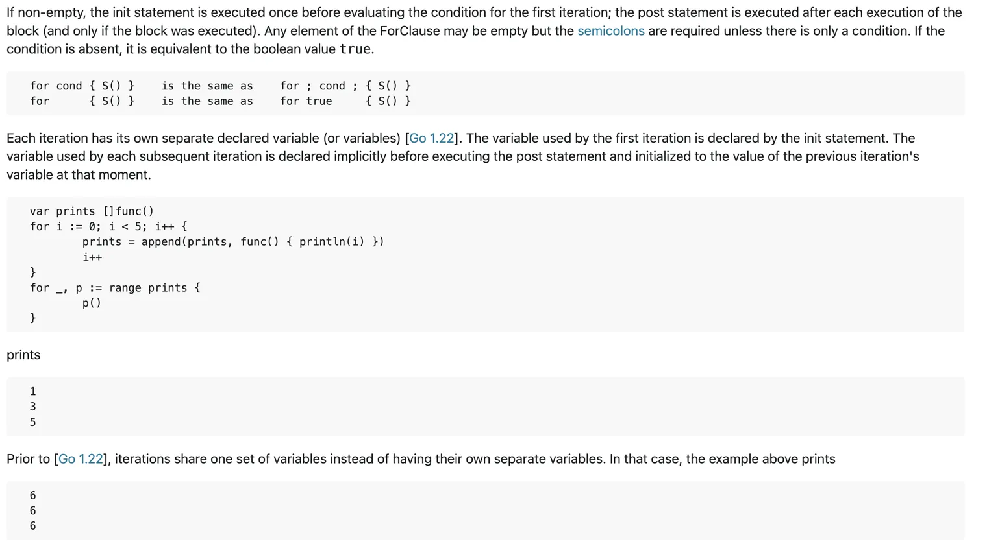
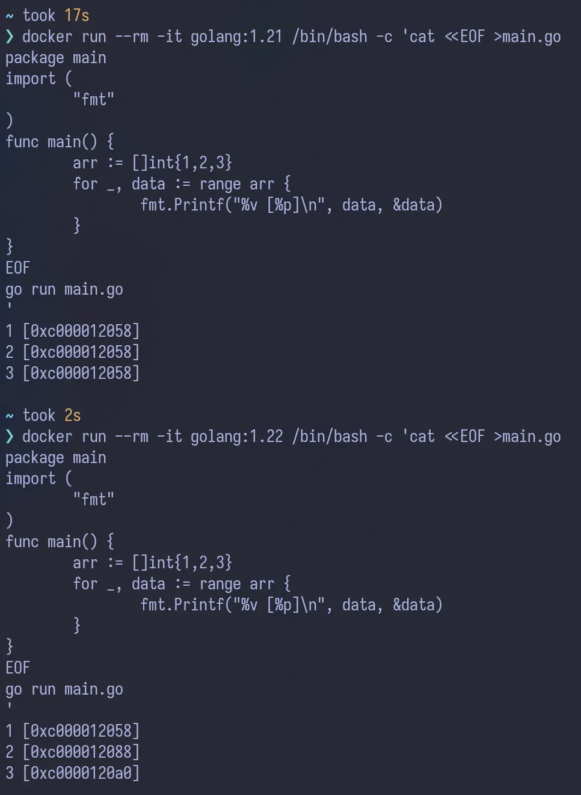
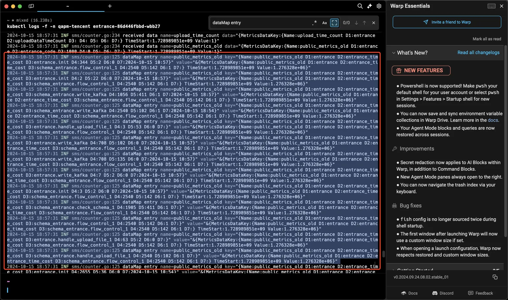
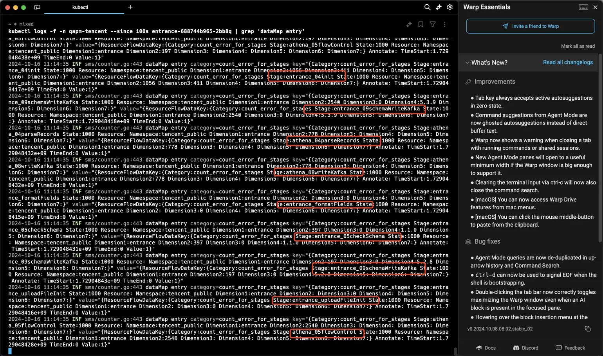

## 导语

坑的内容主要是golang在1.22版本中更新了循环中的临时变量，每次循环为单独的地址，而在旧版本中，所有循环中的临时变量，指向的是同一块内存。说的更详细点：在 Go 1.22 之前的版本中，`for _, p := range arr` 会复用循环变量 p 的地址，即每次迭代时 p 指向同一个内存地址。以`dataMap[data.MetricsDataKey] = &data`为例，此代码将每次循环的 data 的地址存储在 dataMap 中，这会导致所有键都指向同一个内存地址，即最后一个 data 的值。最终导致dataMap所有的value值重复。

<!-- more -->

## Golang1.22的非兼容更新内容

这是官方文档，导语中有说明更新的内容：





这是本地实验，和导语内容相符，在1.22中每次执行循环的的临时变量有了自己的地址。



而因为这次golang的更新，就碰到了一个很逆天的bug。

## Bug描述

首先来看下这块的代码：

```go
for _, data := range arr {
    if res, ok := dataMap[data.MetricsDataKey]; ok {
        res.Value += data.Value
    } else {
        dataMap[data.MetricsDataKey] = &data
    }
}
```

在上述代码中，使用了一个临时变量data来做聚合数据的操作，而在else条件中，将`&data`的值赋值给了dataMap的value。而在本地使用的是1.22版本的服务，所以测试起来没有什么问题。

但是到了线上之后：



可以看到图中有打印出来value的值（在排查了很久数据重复后才加上的很细致的日志，会耗费很多资源），每个value值都是一摸一样的，这就很奇怪。

## 根因分析

无奈之举，只能怀疑是指针问题，于是做了代码修改：

```go
// DeepCopyMetricsData performs a deep copy of MetricsData using JSON serialization
func DeepCopyMetricsData(data MetricsData) MetricsData {
    var copy MetricsData
    bytes, err := json.Marshal(data)
    if err != nil {
        slog.Error("Failed to marshal MetricsData: %v", err)
    }
    if err := json.Unmarshal(bytes, &copy); err != nil {
        slog.Error("Failed to unmarshal MetricsData: %v", err)
    }
    return copy
}

for _, data := range arr {
    if res, ok := dataMap[data.MetricsDataKey]; ok {
        res.Value += data.Value
    } else {
        dataMap[data.MetricsDataKey] = DeepCopyMetricsData(data)
    }
}
```

在上述中因为心虚，甚至做了个深拷贝的操作，只希望不再有数据重复。

没想到经过这次更新，终于是解决了问题，value值没有再度重复。在翻了半天之后，终于找到关于golang的1.22更新说明：[Go 1.22 For Statements](https://go.dev/ref/spec#For_statements)

并且翻开线上服务使用的dockerfile发现用的确实是1.21的golang版本：`golang:1.21-alpine`这个镜像。

## 总结

本质上是因为golang的非兼容性更新，导致本地环境和线上环境的golang不一致，最终造成了一个bug查一周的窘境。

如果需要避免此类问题，后续需要定期更新线上服务的golang版本，尽量保证本地使用版本与线上保持一致。
